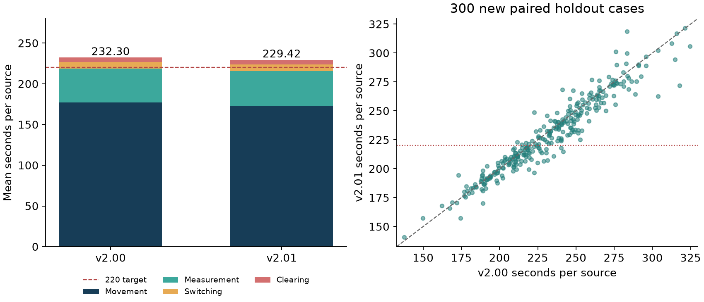

# q3-v2.01：第二轮优化与冻结后验证

全新300例独立主验证：v2.00 **232.30 → v2.01 229.42 秒/源**，平均节省 **2.88 秒/源（1.24%）**，两个版本均300/300全清。
**尚未达到220秒/源**，新版主验证均值距目标还有 9.42 秒。交付的是本轮经过验证的改进候选，没有全局最优证明。全部为离线合成实验，未调用赛方接口。

## 输入、输出、指标与约束

|项目|约定|
|---|---|
|输入|公开机器人坐标、当前频道、剩余时间与实测/实清反馈；策略不能读取真实源数、源位置和接收半径|
|输出|下一动作的位置、频道及动作类型，全部频道解决后的退出状态|
|指标|每例总虚拟动作时间÷该例真实源数，再对案例等权平均；包含检测、切频、失败清除与最后清源后的排空耗时|
|源与空间|圆域半径1800米，10—16源，20个唯一频道，固定接收半径1000—1500米|
|测向与动作|误差±1°，策略外扩至1.01°；移动5米/秒，检测5秒、检测切频1秒，清除成功5秒/失败3秒，清除半径20米|
|依赖|继承v2.00的覆盖认证、共享观测、历史约束和两步定位评分，不依赖前两问真值|

## 为什么改这里

v2.00已显著减少无效检测，本轮重点转向移动。对前16例的离线轨迹诊断发现，测量专用停靠点对应的绕行约 4.96 秒/源；假设已知道最终停靠点后重排，启发式路线还可减少约 8.69 秒/源。这些只是事后诊断：删除测点会失去必要观测，事后路线也使用未来信息，不能当作可实现收益或最优下界。
于是分别尝试减少清除点绕行、连续调整补测点、预测未来路线、改变覆盖顺序/朝向、合并覆盖站、首段集中测向等方向。最终保留两项：先让多源位置更清楚以减少后续折返，再微调每次补测点的连续坐标。

## 冻结方案的实际改动

1. **首段共享测向，联合比较后续路线。** 圆心扫描后，在普通策略首个目标方向附近，比较原候选点，以及距圆心200/300/450米、方向偏转−60/−30/0/30/60度的15个点。对已发现源构造5组可行代表场景，模拟观测后的可行区域和包围圆，估计从测站经过各源中心与覆盖站的后续开放路径。只执行最优候选点的一次真实移动，再在该点补测仍不够精确的已知频道。
   选择分数为：圆心到候选点的距离 + 场景平均后续路线长度 + 0.3×各源 max(包围圆半径−20米, 0) 的和。最后一项是开发集选定的启发式距离罚项，5组代表场景也不是校准后的概率后验；分数不等于精确期望完成时间。
2. **连续优化后续补测位置。** 保留原来的两步前瞻评分，在离散候选中选两个较好起点，以Nelder–Mead在平面上继续搜索，每个起点最多42次评分；只有评分至少改善0.1秒才接受。这样可在原有若干固定候选之间找到更合适的点，兼顾定位效果、当前移动和后续衔接。
3. **沿用已经验证的可行性框架。** 未知频道仍在实际覆盖搜索站扫描，目标停靠可共享已知源测向；使用多起点最近邻＋开放路径2-opt重排。所有正式状态均由真实观测更新，规划中的假设观测只用于选动作。存在源是否清除、无源频道是否覆盖完毕仍按实测结果判断。

## 同场配对结果

|样本|例数|v2.00 秒/源|v2.01 秒/源|节省 秒/源|v2.01全清|
|---|---:|---:|---:|---:|---:|
|原100例开发集|100|229.31|226.40|2.91|100/100|
|全新独立主验证|300|232.30|229.42|2.88|300/300|
|独立噪声机制敏感性|100|228.72|225.44|3.28|100/100|

同一原100例的版本变化为 **v1.99 248.22 → v2.00 229.31 → v2.01 226.40**。这100例用于反复筛选，不能作为独立泛化证据。全新300例只同场比较v2.00与v2.01，不能直接拿上一轮另一批300例的均值相减。
新主验证中，配对节省的95% bootstrap区间为 **[1.78, 3.93] 秒/源**；新版均值区间 [225.74, 233.14]。按案例配对重抽10000次，固定种子920221。配对胜率 62.3%；P90为 275.96 → 273.21。
新版案例中≤220秒/源占 44.0%，≤250占 72.3%，部分案例达标不能写成平均值达标。有限抽样区间不覆盖模拟分布失配等系统性误差。



## 节省了哪部分时间

|独立主验证分项，秒/源|v2.00|v2.01|节省|
|---|---:|---:|---:|
|移动|177.27|173.24|4.03|
|检测|41.64|42.62|-0.98|
|切频|7.93|8.11|-0.19|
|清除|5.47|5.45|0.02|

尾部排空耗时 5.05 → 5.08 秒/源，已包含在上述四项中，不能重复相加。
本轮增加前期测量来换取更短路径；主验证本地计算平均 4.06 → 6.50 秒/案，新版最长 43.25 秒/案。该计算时间受并发、硬件和审计开销影响，不计入虚拟动作指标，也不能代表联网赛方环境的实时表现。

## 压力测试与局限

|场景|例数|v2.00 秒/源|v2.01 秒/源|节省 秒/源|新版全清|
|---|---:|---:|---:|---:|---:|
|圆周布局＋最小半径＋固定+1°|20|340.42|338.72|1.70|20/20|
|圆内均匀＋最小半径＋固定−1°|20|249.71|247.17|2.54|20/20|
|三聚簇＋最小半径|20|194.45|196.69|-2.24|20/20|

聚簇场景平均变慢 2.24 秒/源；在本来已较容易规划的布局中，额外的前期测向可能得不偿失。每个压力场景只有20例，不能证明全场景更快或所有合法布局均可完成。
默认模拟位置按圆面积均匀、源数在10—16均匀、接收半径在1000—1500均匀；默认误差沿用原模拟器基于频道与毫米坐标的固定哈希。独立噪声实验改成包含种子、频道与精确坐标的独立空间哈希，仍在±1°以内。没有证据表明这些分布与赛方隐藏生成器完全一致。
连续评分、5个代表场景与两步前瞻都存在近似；没有精确全局优化和最优性证明。目前证据支持该模拟分布下的平均改进，不能承诺比赛实测达到220。

## 冻结、复现与审计

- 冻结时间UTC 2026-09-12T13:48:11.452351+00:00，策略 SeedRouteContinuous；代码SHA-256见FREEZE.json。冻结后未根据留出结果改动策略。
- 开发集为原种子1405468406—1405468505，先前32例筛选，再对入选方案跑100例；上一轮已经使用的独立集未作为本轮新验证。
- 本轮主验证种子2026096200—2026096499；独立噪声种子2026097200—2026097299；三个压力组各20例，起始种子2026098200、2026098300、2026098400。
- 原v1.99缺失模拟器的问题已在上一轮处理：从工作区题目3本地模拟器补齐，原100例的六项计时精确复现。本轮沿用同一模拟器，未修改计分规则。
- 所有配对基准均通过RobotView白名单限制策略可读接口，并禁用socket；动作轨迹单独累计移动、检测、切频、清除，与模拟总耗时核对。
- 独立噪声100例、压力60例逐步审计：真实源仍在可行域内、包围圆包含全部顶点、choose不写入实测观测状态、存在源不被认证为空。
- 交付版与冻结实验类在5个案例的全部动作轨迹完全一致，并同时通过几何审计。原q3-v1.99及q3-v2.00文件哈希未变。
- Windows进程池在dev100、dev10两次跨策略复用时出现句柄错误；仅使用完整返回的策略结果，缺失部分另目录完整重跑。之后每个策略新建进程池，不能把中断结果当完整成功样本。
- 开发中的ReplaceStation与ReplaceStation8各有1/32失败（搜索动作无进展），失败原样保留，未用看似更低的均值参与排名。修正后的ReplaceProgress单独重跑，未进入最终方案。
- 逐案JSONL、配对CSV、开发清单、冻结哈希与审计结果均在evidence目录；完整所有开发快照保存在工作区q3-opt220-r2/experiments。
- 验证环境使用NumPy 2.3.2、SciPy 1.18.0、Shapely 2.1.2。通用依赖范围写在requirements.txt，不同版本的几何或数值搜索可能带来细微差异。

## 主验证按真实源数分组

|源数（仅评估可见）|例数|v2.00 秒/源|v2.01 秒/源|
|---|---:|---:|---:|
|10|42|280.97|278.84|
|11|39|258.54|256.44|
|12|48|243.83|239.23|
|13|44|227.03|225.41|
|14|38|221.39|216.91|
|15|41|212.19|207.51|
|16|48|187.53|186.73|

## 全100例候选消融与组合

|配置|全清|秒/源|
|---|---:|---:|
|SeedRouteContinuous|100/100|226.401|
|SeedReorient200Continuous|100/100|226.919|
|SeedReorientContinuous|100/100|227.018|
|SeedAllContinuous|100/100|227.239|
|SeedRouteValue|100/100|227.307|
|SeedContinuous|100/100|227.372|
|SeedAllReorientContinuous|100/100|227.587|
|SeedAll|100/100|228.091|
|SeedProbe|100/100|228.215|
|ContinuousProbe|100/100|228.826|
|V200|100/100|229.311|
|ScenarioRouting|100/100|230.572|

ContinuousProbe仅连续补测；SeedProbe仅早期共享测向；SeedRouteValue增加路线与剩余不确定性估值；SeedRouteContinuous组合ContinuousProbe与SeedRouteValue。SeedReorient系列还重设未执行覆盖站朝向，ScenarioRouting尝试未发现源的场景路线估值。
SeedReorientContinuous曾在32例得到222.419秒/源，扩大为100例后回到227.018；因此未凭小样本好成绩宣称接近或达到220。

## 开发实验完整记录

表中均值只为完整且全部成功的配置计算；中断和失败显示“不可排名”。

|实验|配置|返回/计划|成功|秒/源|
|---|---|---:|---:|---:|
|dev01|V200|32/32|32|227.419|
|dev01|ClearRegions|32/32|32|227.556|
|dev01|ClearIncoming|32/32|32|227.283|
|dev01|ContinuousProbe|32/32|32|226.650|
|dev01|ContinuousFine|32/32|32|227.226|
|dev01|ProbeThenClear|32/32|32|227.494|
|dev01|ProbeThenClear500|32/32|32|227.494|
|dev02|ValueShared|32/32|32|227.331|
|dev02|ValueShared0|32/32|32|227.638|
|dev02|RadiusShared|32/32|32|229.864|
|dev02|RadiusShared25|32/32|32|228.513|
|dev02|CostRouting|32/32|32|232.007|
|dev03|ScenarioKnown|32/32|32|229.237|
|dev03|ScenarioRouting|32/32|32|227.421|
|dev03|Scenario15|32/32|32|227.422|
|dev04|CoverageExchange|32/32|32|228.564|
|dev04|CoverageExchange6|32/32|32|228.657|
|dev04|ExchangeContinuous|32/32|32|227.888|
|dev04|ExchangeClear|32/32|32|228.474|
|dev05|SweepRouting|32/32|32|238.879|
|dev05|Sweep0|32/32|32|254.322|
|dev05|Sweep45|32/32|32|256.958|
|dev05|SweepWindow|32/32|32|233.913|
|dev06|OrientationSampling|32/32|32|229.832|
|dev06|OrientationMean|32/32|32|231.631|
|dev06|SeedProbe|32/32|32|225.404|
|dev06|SeedProbe500|32/32|32|227.790|
|dev06|Resume15|32/32|32|227.769|
|dev06|Resume14|32/32|32|227.827|
|dev07|ReplaceStation|32/32|31|不可排名|
|dev07|ReplaceStation8|32/32|31|不可排名|
|dev08|SeedProbe150|32/32|32|229.311|
|dev08|SeedProbe200|32/32|32|225.464|
|dev08|SeedProbe400|32/32|32|226.837|
|dev08|SeedAll|32/32|32|225.209|
|dev08|SeedContinuous|32/32|32|224.470|
|dev09|ReplaceProgress|32/32|32|227.365|
|dev09|ReplaceProgress8|32/32|32|227.363|
|dev10|SeedReorient|32/32|32|225.453|
|dev10|SeedReorient200|32/32|32|225.292|
|dev10|LateOrientation|32/32|32|228.510|
|dev10|SeedLate|32/32|32|225.856|
|dev10|SeedReorientContinuous|1/32|1|不可排名|
|dev100|V200|100/100|100|229.311|
|dev100|SeedProbe|100/100|100|228.215|
|dev100|ContinuousProbe|1/100|1|不可排名|
|dev100|ScenarioRouting|0/100|0|不可排名|
|dev100b|SeedContinuous|100/100|100|227.372|
|dev100b|SeedAll|100/100|100|228.091|
|dev100b|ContinuousProbe|100/100|100|228.826|
|dev100b|ScenarioRouting|100/100|100|230.572|
|dev100c|SeedRouteValue|100/100|100|227.307|
|dev100c|SeedRouteContinuous|100/100|100|226.401|
|dev100c|SeedAllContinuous|100/100|100|227.239|
|dev100d|SeedReorientContinuous|100/100|100|227.018|
|dev100d|SeedReorient200Continuous|100/100|100|226.919|
|dev100d|SeedAllReorientContinuous|100/100|100|227.587|
|dev10_recovered|SeedReorientContinuous|32/32|32|222.419|
|dev11|SeedSurvey|32/32|32|231.954|
|dev11|SeedSurvey300|32/32|32|229.404|
|dev11|SeedSurvey700|32/32|32|231.610|
|dev12|SeedRouteValue|32/32|32|224.699|
|dev12|SeedRouteValue1|32/32|32|225.348|
|dev12|SeedRouteValue0|32/32|32|225.975|

本轮实际运行 53 个不同配置（含v2.00基线），不同样本规模或重跑分别保留记录。未纳入最终版本的覆盖交换、扫掠顺序、更多测量和后验场景等尝试，有些没有改善，有些稳定性不足。

## 运行

在q3-v2.01目录中执行：

```powershell
./run_local.ps1 -Cases 100 -RandomState 1405468406
```

其他电脑安装依赖后：

```powershell
python -m pip install -r requirements.txt
python problem3_strategy.py --cases 100 --random-state 1405468406
python problem3_strategy.py --cases 300 --random-state 2026096200
python problem3_main.py --check
```

交付入口及演练命令见README.md。本地CLI为串行运行，动作均值应一致，计算时间不能与并发基准直接比较。
