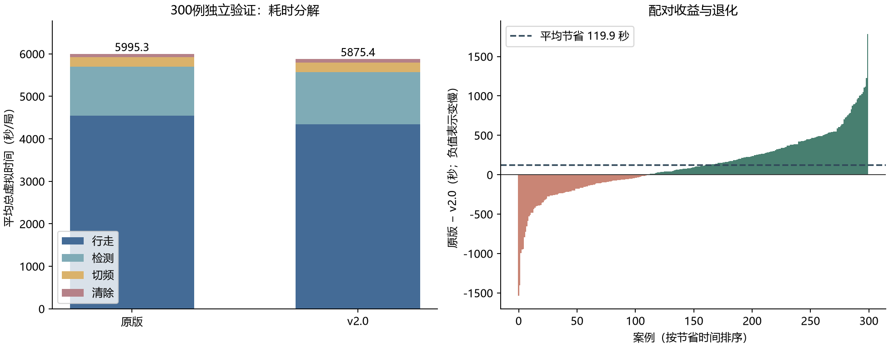

# 第四问 21 点框架优化实验报告

本轮交付 `q4_21-v2.0`，保留原 `q4_21`。所有实验离线完成，没有连接赛方接口。冻结后的 300 例独立验证中，平均总虚拟时间 **5995.33 → 5875.39 秒**，降低 **2.00%**；平均逐局单源时间 **468.00 → 458.73 秒/源**，两版本均 300/300 全清。

## 任务和计量口径

输入：半径1800米区域、1—20频道、10—16个不同频道源；接收半径1000—1500米；方向误差上界1°；全向或半平面定向发射。策略只能调用公开接口，仿真真值不传给策略。输出为连续的检测、补测、清除动作和日志。

主目标是完成搜索并清除全部源的总虚拟秒数 T，包含移动、测量、切频及成功/失败清除。辅助指标是每局 T/N 的算术平均；汇总总时间/总源数是不同口径，独立集分别为 456.03、446.91 秒/源。这里的“单源时间”不是从首次发现到清除的等待时间。

沿用运行入口的非返航口径：`route_end_at_origin=False`。旧离线 CLI 默认却为 True（仅把原点计入收尾路线评分，从未执行返航），所以旧100例报告是6022.71秒/局、472.10秒/源，而统一默认口径的本轮基线为6018.38秒/局、471.76秒/源。90例原本一致，另10例按旧开关重跑后均精确复现旧CSV总时间；见 `evidence/archive_reconciliation.json`。

约束未放宽：保留原21个站坐标、40个三元组和原观测几何；未发现频道仍在每个巡检站检测，除非已发现题设上限16个源。no_signal 不作距离排除。移动5米/秒、检测5秒、切频1秒、清除半径20米、成功5秒/失败3秒。

## 最终方法与选择理由

1. **途中补测。** 已知源的包围圆半径仍大于58米时，在当前路线的1/4、1/2、3/4及目标中心投影位置比较补测。只考虑距估计中心40—900米、交会角至少12°、假设测向可将包围圆收缩到58米以内的位置。每频道最多一次这种额外补测。它利用已要经过的路径，目的是在离开一个区域前定位目标，减少后续折返。该价值估计是启发式；收到真实观测后才更新几何，不把假设观测当真值。
2. **清除后共享测向。** 到达清除点后，对其他未收敛源最多顺带测两个频道，继续采用原边际价值判据。未知频道全扫描额外成本过大，未采用。
3. **多起点开放路线。** 最近邻构造配合2-opt、1—3节点片段移动；用被替换边的差值评价路线变化，避免每个候选都全长回算。巡检与已定位清除点统一滚动排列。收尾保留原补测组合及小规模精确路径方法。该路线是启发式最好已知路线，不是全局最优证明。
4. **凸分块兜底。** 若近处定向遮挡使中心补测失败，将保守可行多边形沿长轴二分，直到每片的最小包围圆半径不超过19.99999米，再按当前位置选择分块圆心清除。二分覆盖原多边形；每片经顶点包围圆检验后，整个凸片都在对应清除盘内，因此清除不依赖发射方向。其作用是减少原全局三角格点中多余的清除尝试。
5. **几何缓存。** 按频道和观测数缓存多边形/包围圆。每次新增正向测向后失效，不改变几何计算口径。

保守可行域仍为目标圆外包多边形与各次“±1°楔形、1500米接收盘外包多边形”的交。所有源位置、朝向和半径只由评估器在结束后核查。原框架的21点覆盖论证沿用，本轮没有为改变后的布局声称覆盖证明；其他目录中不规则21点布局的整数证书并非本策略坐标，本交付未将其混用。

## 开发实验与未采纳项

先在16—24例上筛选，再用原100例（2007525743—2007525842）选版本。选定后记录代码SHA-256及冻结时间，再运行独立集，未按独立结果调参。

| 100例方案 | 平均总时间/秒 | 相对统一基线节省 |
|---|---:|---:|
| 共享补测＋多起点路线 | 5942.97 | 1.25% |
| 途中补测，每频道最多三次＋凸分块清除 | 5921.04 | 1.62% |
| 最终：途中补测每频道最多一次 | 5912.37 | 1.76% |
| 三次补测＋清除邻域 | 5918.59 | 1.66% |
| 无途中补测＋清除邻域 | 5925.65 | 1.54% |

最终开发集由6018.38降至5912.37秒，节省1.76%。16例中清除点无条件扫描未知频道变慢7.98%；24例中把粗略源中心加入路线评分、旋转站点布局均不如最终方向。将定位阈值放宽到100米、将途中补测距离改为600/1200米及增加补测次数均未成为最终版本。清除邻域在100例上未优于最终的单次途中补测，亦未采用。

初次开发路线函数曾在只剩1—3节点时出现空路径边界异常，已修正空路径计价，并对1—8节点例与精确解核对；失败运行不计入性能样本。历史尝试摘要在 `evidence/attempts.json`，完整开发代码在 `research/variants.py`；原实验快照保留在工作区 `q4-opt21/experiments`。

## 冻结后的独立结果

300例种子2026097200—2026097499；配对使用相同源及相同测向误差函数。节省均值119.95秒/局，按案例配对自助抽样5000次得到95%区间 **[77.39, 162.90]秒/局**。188例更快、112例更慢、0例持平。最差回退1535.21秒，最好节省1785.11秒；平均收益不能理解为逐局保证。

| 独立集平均分项 | 原版/秒 | 新版/秒 | 节省/秒 |
|---|---:|---:|---:|
| 行走 | 4542.13 | 4341.50 | 200.63 |
| 检测 | 1161.55 | 1229.08 | -67.53 |
| 切频 | 214.38 | 228.19 | -13.81 |
| 清除 | 77.27 | 76.61 | 0.66 |

原版网格兜底绕过动作统计封装，导致旧分项漏记，但总虚拟时间来自模拟器仍正确。本次比较由独立动作审计器对两个版本逐条累计四项成本，并与模拟器总时间核对；新版分块兜底同时修复了策略自身分项记录。

| 额外验证 | 原版秒/源 | 新版秒/源 | 总时间节省 | 新版全清 |
|---|---:|---:|---:|---:|
| seeded100 | 471.71 | 461.19 | 2.21% | 100/100 |
| minradius | 510.21 | 483.07 | 5.24% | 12/12 |
| directional | 501.11 | 491.05 | 1.87% | 12/12 |
| omni | 419.20 | 408.72 | 3.22% | 12/12 |
| boundary | 571.20 | 559.18 | 2.48% | 12/12 |
| outward | 794.33 | 793.55 | 0.15% | 12/12 |
| cluster | 341.47 | 360.30 | -6.61% | 12/12 |

seeded100 是100个新场景，并将误差函数加入场景种子；其他每组12个新场景。minradius：1000米半径；directional/omni：全定向/全向；boundary：源距圆心1799.99米、半径1000米；outward：边界源全部朝外、半径1000米；cluster：中心(700,400)附近标准差65米高斯聚簇、半径1000米。这些是压力场景，不代表题目真实分布。

压力回退：cluster 平均总时间增加 287.49 秒。小组样本量有限，不能据此推断所有极端配置。

另外21例逐动作独立回算采用7类场景×随种子误差/恒+1°/恒−1°，均检查全清、方位误差边界、真实源包含于可行多边形和包围圆、指令时序及总耗时。新包离线入口实跑与开发结果一致；在线入口仅执行 `--check`，没有验证赛方联网运行。

## 复现、文件与局限

在本目录执行 `python -m pip install -r requirements.txt`，然后 `python problem4_strategy.py --cases 100 --random-state 2007525743`。PowerShell也可执行 `./run_local.ps1 -Cases 100 -RandomState 2007525743`。输出落入新的时间戳子目录；加 `--log-first` 记录首例动作。

配对复现：安装 `requirements-research.txt` 后，执行 `python research/benchmark.py --variants baseline candidate --cases 300 --seed 2026097200 --out rerun300`。独立回放：`python research/verify.py --candidate problem4_strategy.py --out replay_verification.json`。策略、依赖、冻结哈希、逐案例CSV/JSONL、核验代码一并交付。

这是在给定分布和规则模拟器上的平均改进，有启发式失误和单局退化；无全局最优证明、无官方成绩。原始缺失的 simulator.py 无法取回，采用已有第三问恢复版，来源和哈希均记录，旧CSV已对齐。规划墙钟计时受并行争用影响，不能当作固定性能承诺；真实接口延迟、赛方误差分布及计时截止仍需实测。源数上限16与每频道至多一个源是提前结束的必要前提。

所有表格和下图均从 `evidence/summary.json` 及逐案例记录生成。

